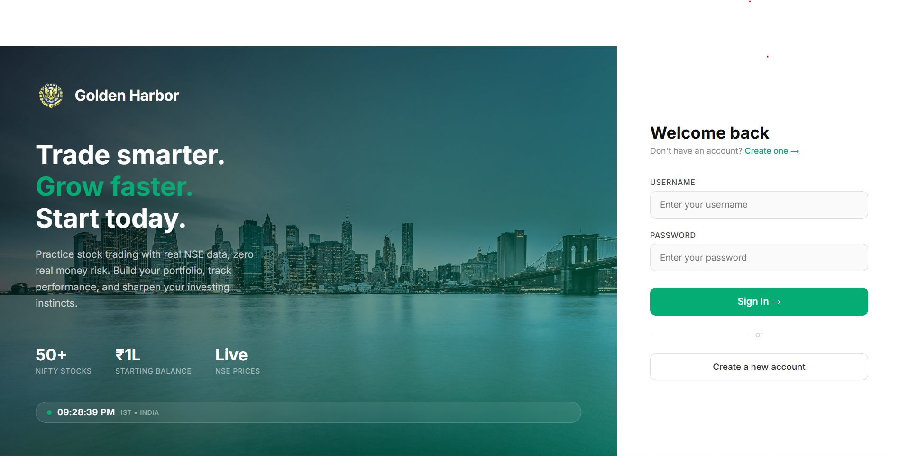
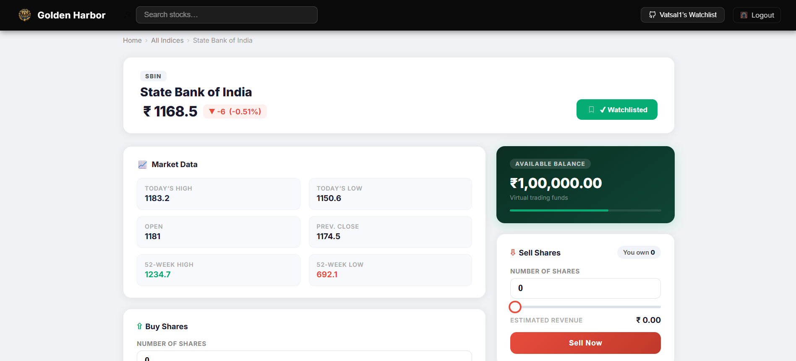

# Golden Harbor 🏦

> A virtual stock trading simulator powered by live NSE (National Stock Exchange) data.

Built with **Flask** · **SQLite** · **jugaad-data** · **yfinance** · **Chart.js**

---

## About the Project

**Golden Harbor** is a paper-trading web application that lets you practice stock trading risk-free using real-time NSE market data. Every user starts with a virtual balance of ₹1,00,000 and can buy/sell NIFTY 50 stocks, track their portfolio, and view historical OHLCV charts - all without spending a single real rupee.

The app is built entirely with Python (Flask) on the backend and vanilla JS + custom CSS on the frontend. No paid APIs or external services are required to get it running locally.

---

## Features

| Feature | Details |
|---|---|
| 📈 Live Prices | NSE live quotes via `jugaad-data`, auto-refreshed every 15 s |
| 🔐 Auth | Register / Login with hashed passwords (PBKDF2-SHA256) |
| 💰 Virtual Balance | Start with ₹1,00,000 - buy deducts, sell credits |
| 🛡️ Validations | Cannot buy if insufficient balance · Cannot short-sell |
| 📋 Watchlist | Add / remove any NIFTY 50 stock · Clear-all · Persisted per user |
| 📊 Stock Charts | Historical OHLCV charts (line or candlestick, multiple time windows) |
| 🔄 Reset | Wipes all holdings & history, restores ₹1,00,000 |
| 🕐 IST Timestamps | Every transaction timestamped in Indian Standard Time |
| 🌐 All Indices | Full NIFTY 50 table with filters, performance sort, and live polling |

---

## Screenshots

**Login Page**


**Stock Detail Page**


---

## Project Structure

```
Stocks Simulation/
├── app.py                  # Flask app - routes, DB models, data helpers
├── ind_nifty50list.csv     # NIFTY 50 company metadata (name, symbol, industry)
├── requirements.txt        # Python dependencies
├── .gitignore
│
├── templates/              # Jinja2 HTML templates
│   ├── login.html          # Login page
│   ├── register.html       # Registration page
│   ├── main.html           # Dashboard - portfolio, history, balance
│   ├── allindices.html     # NIFTY 50 table with live polling & filters
│   ├── eachstock.html      # Individual stock page - buy / sell
│   ├── watchlist.html      # Watchlist dropdown (loaded via AJAX)
│   └── welcome.html        # Landing page
│
├── static/                 # CSS, images, icons
│
└── instance/
    └── users.db            # SQLite database (auto-created on first run)
```

---

## Getting Started

### 1. Clone the repository

```bash
git clone https://github.com/vatsaljain79/Stock_market.git
cd Stock_market
```

### 2. Create and activate a virtual environment

**Windows (PowerShell)**
```powershell
python -m venv venv
.\venv\Scripts\Activate.ps1
```

**macOS / Linux**
```bash
python3 -m venv venv
source venv/bin/activate
```

### 3. Install dependencies

```bash
pip install -r requirements.txt
```

### 4. Run the app

```bash
python app.py
```

Open your browser at **http://127.0.0.1:3001**

> The SQLite database (`instance/users.db`) is created automatically on first run.

---

## Usage

1. **Register** a new account - you start with ₹1,00,000 virtual balance.
2. Go to **All Indices** to see live NIFTY 50 prices (auto-updates every 15 s).
3. Click any stock to open its detail page and **Buy / Sell** using the sliders.
4. Track your portfolio, transaction history, and balance on the **Dashboard**.
5. Use the **Watchlist** (top-right dropdown) to bookmark favourite stocks.
6. Use **Reset Balance** on the dashboard to start fresh.

---

## Tech Stack

| Layer | Technology |
|---|---|
| Web Framework | Flask 2.x |
| Database | SQLite via Flask-SQLAlchemy |
| Live NSE Data | jugaad-data (NSELive) |
| Historical Charts | yfinance (3-tier fallback: `download` → `Ticker.history` → NSE API) |
| Charts | Chart.js |
| Frontend | Vanilla JS + Custom CSS (Inter font) |
| Auth | Werkzeug PBKDF2-SHA256 password hashing |

---

## Notes

- Live NSE data is only available during **market hours** (Mon–Fri, 9:15 AM – 3:30 PM IST). Outside these hours, prices show last known values or `N/A`.
- This app is for **educational / paper trading purposes only**. No real money is involved.
